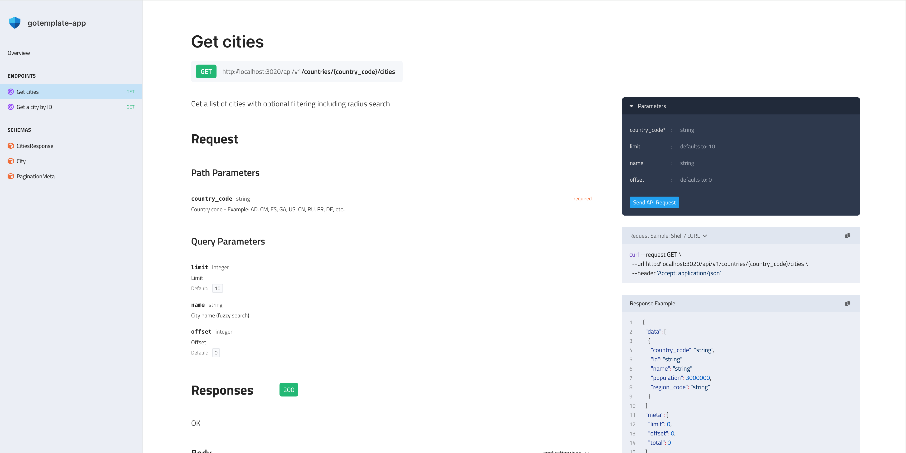

# go-templ-htmx

A minimal starter template for building **server-side rendered (SSR)** Go web applications.
It integrates modern web technologies for rapid development and clean architecture:

* **[templ](https://github.com/a-h/templ)** — Go-based HTML templating engine
* **[htmx](https://htmx.org/)** — Enables dynamic interactions using HTML attributes
* **[postgres](https://postgres.org/)** — For persisting data using the [gorm ORM](https://gorm.io/)

It also uses [swag](https://github.com/swaggo/swag) to generate an openapi specification.

---

## 🚀 Getting Started

First, create a .env file in the root directory of the project. You can use .env.template as a starting point.
Fill in the required env vars for connecting to the postgres database.

Next install dependencies:

```bash
go mod install && npm install
```

### Run with Live Reload

Install [Air](https://github.com/air-verse/air) and start the development server:

```bash
make frontend
```
or
```bash
air -c cmd/frontend/.air.toml
```

Same goes for the backend app.

You can also run `make start` to start backend and frontend with live reload.

You can access the frontend at [http://localhost:3010/](http://localhost:3010/) and the backend at [ http://localhost:4010/](http://localhost:4010/).

### Run Manually

Alternatively, you can run the application without live reload:

```bash
go run cmd/frontend/main.go
```

Same goes for the backend app.
---

### Open API specification

You can access the openapi playground at [http://localhost:3010/docs](http://localhost:3010/docs)



## 💡 Contributing

Contributions are welcome!
Here are a few ways you can help:

* Open a **pull request** to add new features or improve existing code
* Report **bugs** or propose ideas by creating a **new issue**

---

## 🧭 License

This project is open source and available under the [MIT License](LICENSE).
